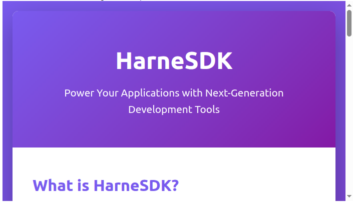

# harnesdk


Run major agents and harnesses programmatically, in a sandbox. Openclaw, Claude Code, Hermes agent,...

* [GitHub](https://github.com/alaeddine-13/harnesdk/) | [PyPI](https://pypi.org/project/harnesdk/) | [Documentation](https://alaeddine-13.github.io/harnesdk/)
* Created by [Alaeddine Abdessalem](https://github.com/alaeddine-13) | PyPI [@alaeddineabdessalem](https://pypi.org/user/alaeddineabdessalem/)
* MIT License

## Installation

```bash
pip install harnesdk
```

## Setup

Set the required environment variables:

```bash
export ANTHROPIC_API_KEY=your_anthropic_api_key
export E2B_API_KEY=your_e2b_api_key
```

## Usage

### Run an agent and get output

```python
import asyncio
from harnesdk.agent import AgentSession

async with AgentSession() as session:
    result = await session.run("Create a hello world HTTP server in Go")
    print(result.output)
```

### Stream output in real time

```python
import asyncio
from harnesdk.agent import AgentSession

async with AgentSession() as session:
    async for chunk in session.stream("Create a hello world HTTP server in Go"):
        print(chunk, end="", flush=True)
```

### Run and serve an app from the sandbox (Jupyter)

```python
from harnesdk.agent import AgentSession
from IPython.display import IFrame

async with AgentSession() as session:
    async for chunk in session.stream(
        "build an 'introducing HarneSDK' html page, and serve it with python http server under port 8000. "
        "Use this pattern nohup your-server-command > /tmp/server.log 2>&1 < /dev/null &"
    ):
        print(chunk)
    page_url = session.sandbox.get_host(8000)
    print(f"app live at {page_url}")
    display(IFrame(f"https://{page_url}", width=700, height=400))
```

Output:
```text
I'll create an introductory HTML page for HarneSDK and serve it using Python's HTTP server on port 8000.

The server is now running at **http://localhost:8000**

app live at 8000-7zerfgtyjcjpl79a141ez.e2b.app
```
Generated app:



## Development

To set up for local development:

```bash
# Clone your fork
git clone git@github.com:your_username/harnesdk.git
cd harnesdk

# Install in editable mode with live updates
uv tool install --editable .
```

This installs the CLI globally but with live updates - any changes you make to the source code are immediately available when you run `harnesdk`.


## Author

harnesdk was created in 2026 by Alaeddine Abdessalem.
